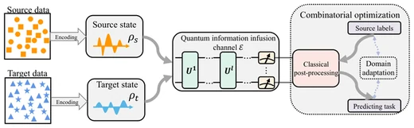

# xh-xihe.github.io

Academic homepage of **Xi He** — Research Associate, Department of Physics,
The University of Texas at Dallas.

A hand-written static site. No build step, no framework, no third-party requests.
Open `index.html` in a browser and it works.

```
index.html      all content + the paper-teaser SVG sprite
styles.css      design tokens and every rule
script.js       theme, language, publication filter/search, BibTeX export
cv.pdf          the published CV
                (cv.tex is the source and is deliberately NOT published —
                 its LaTeX comments would be world-readable; keep it local
                 and regenerate with:  pdflatex cv.tex   (run twice))
assets/
  profile.jpg   ← drop an 800x800 square photo here; until then
                  the page falls back to an "XH" monogram
  favicon.svg
  og.jpg        social-share card (1200x630) — portrait plus the
                same type block as the page; rebuilt by .preview/og.py
  fonts.css     @font-face rules
  fonts/        self-hosted Inter + Source Serif 4 (works behind the GFW)
  papers/       the real figure from each paper, plus drawn fallbacks
  logos/        institution marks on the Experience rows
```

---

## Adding a publication

Copy any `<li class="pub">` block in `index.html` and edit it. The anatomy:

```html
<li class="pub" data-type="preprint" data-year="2026">
  <!--          ^ preprint | journal | conference | patent — drives the filter chips
                                    ^ used only by the BibTeX export; the visible
                                      year is typed into .pub-venue below, so keep
                                      the two in agreement -->
  <a class="pub-fig" href="LINK" target="_blank" rel="noopener" tabindex="-1" aria-hidden="true">
    <svg viewBox="0 0 220 150"><use href="#t-fusion"/></svg>
  </a>
  <div class="pub-body">
    <h3 class="pub-title"><a href="LINK" ...>Title</a></h3>
    <p class="pub-authors"><span class="me">Xi He</span>, Co Author</p>
    <!--                          ^ .me renders your name bold -->
    <p class="pub-venue"><em>Venue</em> <strong>12</strong>, 3456 · 2026</p>
    <p class="pub-tldr">One sentence on what the paper actually does.</p>
    <p class="pub-links"><a href="..." target="_blank" rel="noopener">arXiv</a></p>
  </div>
</li>
```

The **BibTeX** button is added by `script.js` from this markup — you do not
write it. Keep the class names and it will keep working.

### Paper figures

Thirteen of the twenty entries show **the real figure from the paper itself**,
cropped and trimmed from the open source:

| source | papers |
|---|---|
| arXiv HTML rendering (`arxiv.org/html/<id>`) | the 9 arXiv papers |
| arXiv PDF, page rendered with `pdftocairo` (the figure is vector) | `t-variance` |
| Google Patents PDF, drawing sheet rendered | the 3 patents |

They live in `assets/papers/*.webp`, at 520px wide — about 2.4x the 220px column,
so they stay sharp on a retina display — and total under 300 KB.

The remaining **seven have no obtainable figure** and keep a hand-drawn schematic
instead. Four are behind paywalls with no open-access copy and no preprint
(`t-genn` ICASSP, `t-qjda` IEEE PRAI, `t-qksa` ACM, `t-carbon` Elsevier, plus
`t-tjunction` IEEE AP-S); two are APS March Meeting abstracts, which have no
figures at all (`t-manifold`, `t-qlr`). If you have the accepted PDFs, drop a
crop into `assets/papers/` and swap the element — see below.

Every drawing that was replaced is preserved in
`assets/papers/_drawn-originals.svg`, so nothing was thrown away.

**Swapping a figure.** A real figure is an ``; a drawn one is an `<svg><use>`:

```html
<!-- real figure from the paper -->


<!-- hand-drawn fallback, theme-aware -->
<svg viewBox="0 0 220 150"><use href="#t-genn"/></svg>
```

Keep the `width`/`height` attributes accurate — they reserve the space so the
page does not jump while images load. Any aspect ratio works: the figure column
is a fixed 220px wide and the height follows the image, clamped to 88–200px with
`object-fit: contain`, so nothing is ever cropped.

To preview all twenty as the page renders them, light and dark:

```bash
python .preview/build.py     # writes .preview/figures.html
```

---

## Design notes

Two type roles, and everything follows from them:

* **serif** (Source Serif 4) = language a human wrote — the lead paragraph,
  paper titles, the one-line summaries
* **sans** (Inter) = anything a machine labels — nav, authors, venues, chips

The accent is **ink, not hue**: `#14161a` on white, `#e7e9ec` on black. The page
is fully monochrome — there is not one chromatic value in `styles.css`. Because
colour no longer marks a link, every inline link carries an underline instead;
chips, nav rows and card links opt out because their own box already says they
are clickable.

The one exception to the monochrome rule is the emoji. They mark every heading,
news line, honour, timeline entry, contact link and the theme toggle — the only
colour on the page, which is what makes them findable: the eye reaches the mark
before it reads the label. There is no icon sprite left; the emoji replaced it
entirely. They are `aria-hidden` (the date and the sentence already carry the
meaning) and hidden in print, where a colour bitmap becomes grey mush.

The institution marks on the Experience and Education lines are self-hosted
72px PNGs in `assets/logos/`, normalised from four differently-shaped sources
(an app icon, a 48px crest, a white wordmark drawn for a dark header) by
trimming each to its own ink and centring it on a square. The high-resolution seal UESTC
publishes is white-on-transparent (drawn for a dark header), so its alpha is
kept and the RGB replaced with #003478 — the blue UESTC inks the same seal
with in its own favicon, sampled rather than chosen.

The page sits on an **opaque sheet** — `.shell` carries `--surface`, a hairline
border and a soft shadow. That is what makes a backdrop possible at all: text
is on solid ground, so nothing behind the page can move a contrast ratio, and
the margins are genuinely outside the document.

Behind it is a **grainy mesh gradient**: four soft colour fields, heavily
blurred, drifting slowly, with film grain over the top. No shapes and no
diagrams. Three earlier versions drew the subject matter — lattices, circuits,
a network — in the margins, and all three read as clip art in the empty space
however carefully they were drawn. What looks expensive is material, not
spectacle.

Two findings are worth keeping written down, because they are not obvious and
cost several attempts to learn:

* The aurora/glow recipe that reads as premium everywhere else is a **dark-mode
  technique**. A glow needs something to glow against; on this page's white
  default it has nothing and turns to grey smudge.
* The grain is **structural, not decorative**. A gradient this large bands
  visibly on 8-bit panels, and a few percent of noise breaks the bands up and
  reads as material. It is an inline `feTurbulence` data URI, so the page still
  makes no third-party request. The sheet gets a whisper of the same grain from
  a `::before` at `z-index: -1` — above the sheet's background, below its
  content, so the texture is on the paper and never on the ink.

The blur sits on each blob rather than on their container: a filter on a
container whose children move re-runs every frame, while on the blob it
rasterises once and is then only translated by the compositor. Four animations,
all `transform`. The whole layer mounts from 1280px, where the sheet starts
leaving margin worth looking at, and is disabled under `prefers-reduced-motion`,
in print, and in forced-colors.

The background is the only place on the page with hue besides the emoji. To
return it to pure ink, drop the four `.g1`–`.g4` background colours.

All colours are contrast-checked in both themes: body text ≥ 15:1,
muted text ≥ 6.5:1, links ≥ 5.3:1.

### Changing the accent colour

Two lines in `styles.css` — `--accent` and `--accent-hover` in `:root`, and the
same pair in the two dark-theme blocks. `--accent-soft` is the tint behind
chips, `--accent-line` the border that pairs with it.

---

## Citation counts

Each publication with a DOI shows its citation count on the venue line. The number
is **baked into `index.html`**, not fetched by the browser — so the page keeps its
zero-third-party-request property and the count is still there with JavaScript off.

```bash
python tools/update-citations.py            # rewrite the counts from OpenAlex
python tools/update-citations.py --dry-run  # look first
```

Safe to run repeatedly; it replaces its own output rather than stacking. A paper
with no recorded citations shows no line at all — one uniform rule, applied to
every entry, which is also how Google Scholar behaves.

`.github/workflows/refresh-citations.yml` runs it weekly. It deploys through
`actions/deploy-pages` rather than a plain `git push`, because **a commit pushed
with the default `GITHUB_TOKEN` does not trigger a Pages build** — the number
would update in the repo and never reach the live site.

A degraded-but-successful OpenAlex reply (a 200 whose `results` array is empty,
after a filter-syntax change or a re-index) would otherwise strip every count and
publish the wiped page unattended, so the script refuses to write when the number
of counts drops by more than a third and exits non-zero instead.

## Deployment

Two workflows, deliberately separate:

| | trigger | what it does |
|---|---|---|
| `deploy.yml` | push to `main` | builds and publishes. Read-only token, no external calls — a push must not be able to fail on a third party being reachable. |
| `refresh-citations.yml` | Monday 04:17 UTC, or manually | refreshes the counts from OpenAlex, commits, then publishes. |

**Prerequisite that is not visible from the workflow files:** the repository must
have *Settings → Pages → Source* set to **GitHub Actions**. A `username.github.io`
repo defaults to *Deploy from a branch*, and `actions/configure-pages@v5` cannot
switch it — its `enablement` input requires a token other than `GITHUB_TOKEN`.
With the wrong source, the very first run fails at `configure-pages` with an
error that does not name the cause.

Pages also requires the repository to be **public** on a free plan; private
repositories need GitHub Pro or above.

## Keyboard

`/` focuses the publication search. That is the only global binding — no
single-letter hotkeys that fire while you are reading.

## Local preview

```bash
python -m http.server 8765
# then open http://127.0.0.1:8765
```

Needed because the fonts are loaded over HTTP; `file://` will not serve them.

## Regenerating the fonts

`assets/fonts/` holds variable-font subsets pulled once from Google Fonts and
committed, so the page makes **zero third-party requests** and renders
identically in mainland China. To refresh them, re-download the CSS that
`fonts.css` was generated from and re-run the extraction — or just leave them;
they do not go stale.
